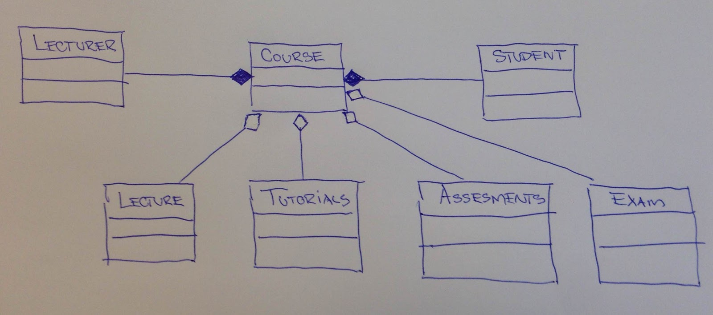

# 38 Exercise Class and Class Diagram

## Exercise 1: 
> Make a Class diagram for the below mentioned classes. Use association, aggregation (has-a), composition (is part off) where it is appropriate.

A. Village, Street, House, Road, Sidewalk, Shop    
B. Zoo, Bird, Cage, Zookeeper, Reptile. Lion    
C. Cookbook, Dish, Ingredients, Author, Starter/first course, Vegetable, main course, Meat, Dessert    
D. Invoice, Customer, Employee, Line item    

## Exercise 2: Make a short description about the information present in the Class Diagram.

© KEA, (red. clbo 26-09-2016)
